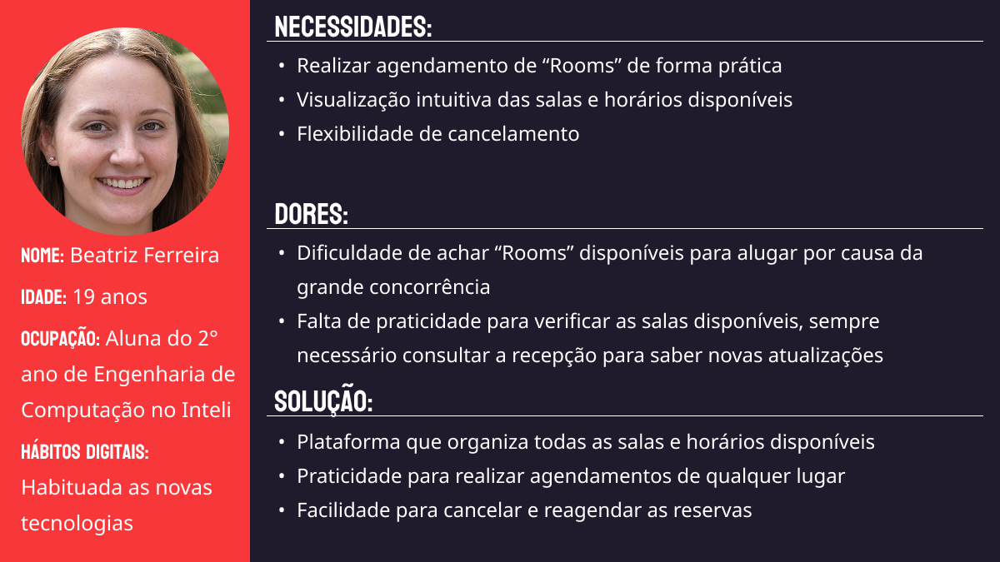

# Web Application Document - Projeto Individual - Módulo 2 - Inteli

## RX

#### Maria Vitória dos Santos

## Sumário

1. [Introdução](#c1)  
2. [Visão Geral da Aplicação Web](#c2)  
3. [Projeto Técnico da Aplicação Web](#c3)  
4. [Desenvolvimento da Aplicação Web](#c4)  
5. [Referências](#c5)  

<br>

## <a name="c1"></a>1. Introdução

&emsp; O RX é um sistema desenvolvido para otimizar e facilitar a locação de salas no Inteli, atendendo à demanda por espaços de estudo. Em meio à rotina desafiadora da faculdade, os alunos, professores e funcionários sentem a necessidade de locais reservados para trabalharem de forma proveitosa e, nesse âmbito, o Inteli oferece as Rooms (popularmente conhecidas como "casinhas"), que são salas equipadas com televisores e quadros brancos, ideais para reuniões em grupo e para o desenvolvimento dos projetos que a faculdade oferta. <br>
&emsp; Para auxiliar ainda mais a vida do time do Inteli, a plataforma RX inova a forma como as salas são reservadas. Com uma interface intuitiva e simples, os usuários conseguem visualizar as salas disponíveis em diferentes horários para o dia atual, sendo possível agendá-las para uso em intervalos de uma hora. Ao realizar o agendamento, o usuário pode acompanhar sua reserva, podendo editá-la ou cancelá-la quando necessário, além de receber notificações para evitar que se esqueça do agendamento, otimizando o uso do espaço. Como as "casinhas" são altamente disputadas, o aluno poderá, caso não haja mais salas disponíveis, ativar notificações sobre o cancelamento de algum espaço. Assim, ele ficará ciente da possibilidade de reservá-lo sem precisar conferir constantemente a plataforma. <br>
&emsp; Com todas essas funcionalidades, o RX proporciona não só uma experiência mais prática e eficiente aos alunos, como também auxilia o time de gestão do Inteli a organizar melhor as demandas pelos locais de estudo. A plataforma oferece um ganho significativo de agilidade e controle, promovendo um ambiente acadêmico mais organizado, funcional e alinhado com as necessidades da comunidade.<br>

## <a name="c2"></a>2. Visão Geral da Aplicação Web

### 2.1. Personas

&emsp; Com o intuito de atender às necessidades dos usuários do RX, é fundamental a definição de personas. Papéis fictícios que representam possíveis usuários direcionam as funcionalidades essenciais para o desenvolvimento da plataforma, garantindo que o sistema seja intuitivo, eficiente e verdadeiramente útil para quem o utiliza no dia a dia. <br>
&emsp; As personas permitem identificar comportamentos, expectativas e desafios específicos dos diferentes perfis de usuários, o que é crucial para construir uma experiência que atenda diretamente às suas necessidades. <br>
<div align="center">
<figcaption><strong>Figura 1 - Persona 1</strong></figcaption>
<br>

<br>
<em>Fonte: Material produzido pela autora (2025)</em>
</div>
&emsp; Assim, esse processo auxilia e orienta o desenvolvimento técnico do RX, consolidando uma solução eficaz e alinhada às necessidades dos usuários. <br>

### 2.2. User Stories

&emsp; Para refinar as funcionalidades do RX e atender as reais necessidades dos usuários, é fundamental entender as histórias do usuários. Elas descrevem, de forma simples,as ações esperadas pelas personas analizadas.<br>

Identificação | US01
--- | ---
Persona | Beatriz Ferreira
User Story | Como estudante do Inteli, quero agendar as Rooms por meio de uma plataforma digital, para que eu possa reservar de qualquer lugar e otimizar o meu dia
Critério de aceite 1 | Agendamento - o usuário deverá conseguir agendar pela plataforma
Critério de aceite 2 | Confirmação - o usuário deverá receber uma mensagem de confirmação ao reservar sua sala

### Critérios INVEST 
- **Independente:** o agendamento independe de outros processos disponíveis na plataforma, bastando o usuário acessar as salas disponíveis e agendar seu horário de preferência
- **Negociável:** a forma como esse agendamento é realizado pode ser negociável; os recursos utilizados, a interface aplicada e a forma de reserva podem ser definidos de diversas maneiras
- **Valiosa:** como principal função dentro da plataforma, ter a possibilidade de realizar agendamentos de forma online é uma característica valiosa para o negócio
- **Estimável:** as funcionalidades necessárias para desenvolver essa solução são estimáveis, considerando que envolvem a escolha da sala e do horário disponíveis, o agendamento e a confirmação da reserva
- **Sob medida:** por ser uma funcionalidade específica, o agendamento é uma demanda de medida reduzida e adequada para um ciclo de desenvolvimento
- **Testável:** o recurso pode ser validado testando a capacidade do sistema de listar salas e horários, permitir a escolha, efetuar o agendamento e gerar a confirmação para o usuário

<br>

Identificação | US02
--- | ---
Persona | Beatriz Ferreira
User Story | Como estudante do Inteli, quero poder cancelar minhas reservas pela plataforma, para que eu possa cancelar de qualquer lugar e em qualquer momento, disponibilizando o espaço para outro usuário
Critério de aceite 1 | Acesso a lista de reservas - o usuário deverá conseguir visualizara sua reserva
Critério de aceite 2 | Opção de cancelamento - o usuário deverá conseguir cancelar um agendamento ativo
Critério de aceite 3 | Confirmação cancelamento - o usuário deverá receber uma confirmação de cancelamento de reserva

<br>

Identificação | US03
--- | ---
Persona | Beatriz Ferreira
User Story | Como estudante do Inteli, quero visualizar rapidamente as *Rooms* disponíveis, para que assim eu possa reservar uma sala no espaço e no horário mais oportuno para meus projetos
Critério de aceite 1 | Visualização - o usuário deverá conseguir ver as salas e horários disponíveis para reserva
Critério de aceite 2 | Atualização - o sistema deverá atualizar a disponibilidade das salas com novos agendamentos e cancelamentos

<br>

&emsp; Assim, é evidente a importância da utilização das User Stories no desenvolvimento do RX, garantindo que as expectativas estejam alinhadas à realidade e priorizando a entrega de uma plataforma consistente e satisfatória. <br>

---

## <a name="c3"></a>3. Projeto da Aplicação Web

### 3.1. Modelagem do banco de dados

&emsp; A modelagem do banco de dados é uma parte essencial do desenvolvimento de plataformas WEB, pois garante uma estrutura eficiente para o armazenamento e gerenciamento das informações. O banco de dados é responsável por armazenar dados cruciais, como as informações dos usuários, das salas disponíveis e das reservas realizadas. <br>

## Modelo Relacional (Lógico)
&emsp; O modelo relacional do banco de dados descreve a estrutura lógica das informações e como elas se relacionam. Ele é representado por meio de diagramas com tabelas, atributos (colunas) e relacionamentos (chaves primárias e estrangeiras). <br>

<div align="center">
<figcaption><strong>Figura 2 - Modelo Lógico do Banco de Dados</strong></figcaption>
<br>

<br>
<em>Fonte: Material produzido pela autora (2025)</em>
</div>

&emsp; O modelo relacional da plataforma RX é composto por:
- **users**: armazena informações dos usuários (nome, e-mail, turma, grupo, etc.).

- **rooms**: contém os dados das salas de estudo disponíveis para reserva.

- **predefined_times**: define os horários padronizados que os usuários podem escolher ao realizar reservas.

- **bookings**: representa cada reserva feita por um usuário para uma sala, em uma data e horário específicos.

### Relações entre as tabelas
A tabela bookings se relaciona com:

- users por meio da coluna user_id: cada reserva pertence a um usuário.

- rooms por meio da coluna room_id: cada reserva está associada a uma sala específica.

- predefined_times por meio da coluna time_slot_id: cada reserva ocorre dentro de um horário predefinido.

&emsp; Essas relações garantem integridade referencial, ou seja, impedem que sejam registradas reservas para salas inexistentes, usuários inválidos ou horários que não estão no sistema. <br>

## Modelo Físico
&emsp; O modelo físico é a implementação concreta do modelo relacional. Ele traduz a estrutura lógica para comandos SQL.

[Acesse o modelo físico da plataforma RX (init.sql)](../scripts/init.sql)

```sql
-- init.sql
CREATE TABLE users (
  user_id SERIAL PRIMARY KEY,
  name VARCHAR(100),
  email VARCHAR(100) UNIQUE,
  class VARCHAR(3),
  group_number INT,
  google_id VARCHAR(100) UNIQUE
);

CREATE TABLE rooms (
  room_id SERIAL PRIMARY KEY,
  room_number VARCHAR(20) UNIQUE,
  location VARCHAR(100)
);

CREATE TABLE predefined_times (
  time_slot_id SERIAL PRIMARY KEY,
  start_time TIME,
  end_time TIME
);

CREATE TABLE bookings (
  booking_id SERIAL PRIMARY KEY,
  user_id INT,
  room_id INT,
  date DATE,
  time_slot_id INT,
  status VARCHAR(30),

  FOREIGN KEY (user_id) REFERENCES users(user_id) ON DELETE CASCADE,
  FOREIGN KEY (room_id) REFERENCES rooms(room_id) ON DELETE CASCADE,
  FOREIGN KEY (time_slot_id) REFERENCES predefined_times(time_slot_id)
);
```


&emsp; A modelagem do banco de dados, tanto em seu nível relacional quanto físico, é fundamental para o funcionamento correto e eficiente da plataforma RX. O modelo relacional organiza os dados e define as regras lógicas entre as entidades, enquanto o modelo físico implementa essas regras no banco de dados real. Com essa estrutura, o RX consegue oferecer um sistema confiável e escalável de reserva de salas, com validações automáticas e integridade dos dados garantida por meio das relações entre as tabelas. <br>

### 3.1.1 BD e Models (Semana 5)
*Descreva aqui os Models implementados no sistema web*

### 3.2. Arquitetura (Semana 5)

*Posicione aqui o diagrama de arquitetura da sua solução de aplicação web. Atualize sempre que necessário.*

**Instruções para criação do diagrama de arquitetura**  
- **Model**: A camada que lida com a lógica de negócios e interage com o banco de dados.
- **View**: A camada responsável pela interface de usuário.
- **Controller**: A camada que recebe as requisições, processa as ações e atualiza o modelo e a visualização.
  
*Adicione as setas e explicações sobre como os dados fluem entre o Model, Controller e View.*

### 3.3. Wireframes

&emsp; Wireframe é uma representação visual simples da interface de um sistema, nesse caso, o sistema WEB, ela auxilia na estruturação do site final, permite visualizar a estrutura do site e a organização dos elementos principais e o fluxo de navegação. <br>
&emsp; No contexto do projeto, o wireframe foi criado para representar a proposta funcional da plataforma de reserva de salas, garantindo que todos os componentes essenciais — como login com conta Google, exibição de salas disponíveis, formulário de reserva e gestão de agendamentos — estejam presentes e bem posicionados. <br>

[Acesse o Wireframe da plataforma RX](https://www.figma.com/design/vHx0qLkNj1X5AI8aU02OT9/RX?node-id=20-2&t=TJE6iLSurOA6y6G9-1)

&emsp; A construção do wireframe representa um passo essencial no desenvolvimento da plataforma RX, pois permite antecipar e planejar a experiência de uso com base nas funcionalidades definidas. Com ele, é possível validar o fluxo de interação dos usuários de maneira clara e objetiva. <br>

### 3.4. Guia de estilos (Semana 05)

*Descreva aqui orientações gerais para o leitor sobre como utilizar os componentes do guia de estilos de sua solução.*


### 3.5. Protótipo de alta fidelidade (Semana 05)

*Posicione aqui algumas imagens demonstrativas de seu protótipo de alta fidelidade e o link para acesso ao protótipo completo (mantenha o link sempre público para visualização).*

### 3.6. WebAPI e endpoints (Semana 05)

*Utilize um link para outra página de documentação contendo a descrição completa de cada endpoint. Ou descreva aqui cada endpoint criado para seu sistema.*  

### 3.7 Interface e Navegação (Semana 07)

*Descreva e ilustre aqui o desenvolvimento do frontend do sistema web, explicando brevemente o que foi entregue em termos de código e sistema. Utilize prints de tela para ilustrar.*

---

## <a name="c4"></a>4. Desenvolvimento da Aplicação Web (Semana 8)

### 4.1 Demonstração do Sistema Web (Semana 8)

*VIDEO: Insira o link do vídeo demonstrativo nesta seção*
*Descreva e ilustre aqui o desenvolvimento do sistema web completo, explicando brevemente o que foi entregue em termos de código e sistema. Utilize prints de tela para ilustrar.*

### 4.2 Conclusões e Trabalhos Futuros (Semana 8)

*Indique pontos fortes e pontos a melhorar de maneira geral.*
*Relacione também quaisquer outras ideias que você tenha para melhorias futuras.*


## <a name="c5"></a>5. Referências

_Incluir as principais referências de seu projeto, para que seu parceiro possa consultar caso ele se interessar em aprofundar. Um exemplo de referência de livro e de site:_<br>

---