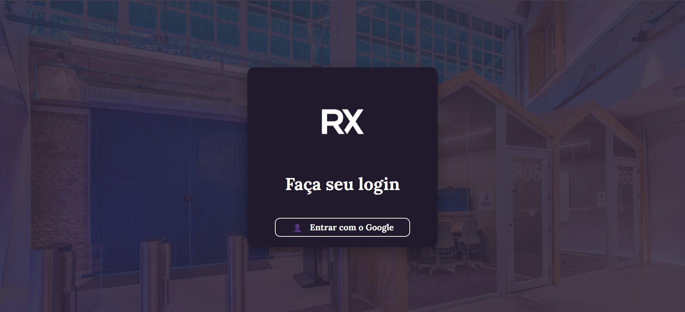
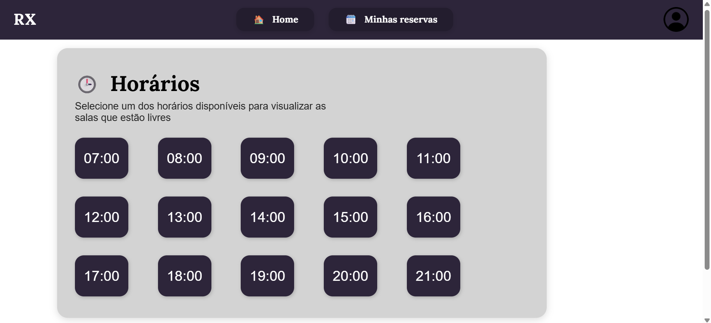

# Web Application Document - Projeto Individual - Módulo 2 - Inteli

## RX

#### Maria Vitória dos Santos

## Sumário

1. [Introdução](#c1)  
2. [Visão Geral da Aplicação Web](#c2)  
3. [Projeto Técnico da Aplicação Web](#c3)  
4. [Desenvolvimento da Aplicação Web](#c4)  
5. [Referências](#c5)  

<br>

## <a name="c1"></a>1. Introdução

&emsp; O RX é um sistema desenvolvido para otimizar e facilitar a locação de salas no Inteli, atendendo à demanda por espaços de estudo. Em meio à rotina desafiadora da faculdade, os alunos, professores e funcionários sentem a necessidade de locais reservados para trabalharem de forma proveitosa e, nesse âmbito, o Inteli oferece as Rooms (popularmente conhecidas como "casinhas"), que são salas equipadas com televisores e quadros brancos, ideais para reuniões em grupo e para o desenvolvimento dos projetos que a faculdade oferta. <br>
&emsp; Para auxiliar ainda mais a vida do time do Inteli, a plataforma RX inova a forma como as salas são reservadas. Com uma interface intuitiva e simples, os usuários conseguem visualizar as salas disponíveis em diferentes horários para o dia atual, sendo possível agendá-las para uso em intervalos de uma hora. Ao realizar o agendamento, o usuário pode acompanhar sua reserva, podendo editá-la ou cancelá-la quando necessário, além de receber notificações para evitar que se esqueça do agendamento, otimizando o uso do espaço. Como as "casinhas" são altamente disputadas, o aluno poderá, caso não haja mais salas disponíveis, ativar notificações sobre o cancelamento de algum espaço. Assim, ele ficará ciente da possibilidade de reservá-lo sem precisar conferir constantemente a plataforma. <br>
&emsp; Com todas essas funcionalidades, o RX proporciona não só uma experiência mais prática e eficiente aos alunos, como também auxilia o time de gestão do Inteli a organizar melhor as demandas pelos locais de estudo. A plataforma oferece um ganho significativo de agilidade e controle, promovendo um ambiente acadêmico mais organizado, funcional e alinhado com as necessidades da comunidade.<br>

## <a name="c2"></a>2. Visão Geral da Aplicação Web

### 2.1. Personas

&emsp; Com o intuito de atender às necessidades dos usuários do RX, é fundamental a definição de personas. Papéis fictícios que representam possíveis usuários direcionam as funcionalidades essenciais para o desenvolvimento da plataforma, garantindo que o sistema seja intuitivo, eficiente e verdadeiramente útil para quem o utiliza no dia a dia. <br>
&emsp; As personas permitem identificar comportamentos, expectativas e desafios específicos dos diferentes perfis de usuários, o que é crucial para construir uma experiência que atenda diretamente às suas necessidades. <br>
<div align="center">
<figcaption><strong>Figura 1 - Persona 1</strong></figcaption>
<br>

<br>
<em>Fonte: Material produzido pela autora (2025)</em>
</div>
&emsp; Assim, esse processo auxilia e orienta o desenvolvimento técnico do RX, consolidando uma solução eficaz e alinhada às necessidades dos usuários. <br>

### 2.2. User Stories

&emsp; Para refinar as funcionalidades do RX e atender as reais necessidades dos usuários, é fundamental entender as histórias do usuários. Elas descrevem, de forma simples,as ações esperadas pelas personas analizadas.<br>

Identificação | US01
--- | ---
Persona | Beatriz Ferreira
User Story | Como estudante do Inteli, quero agendar as Rooms por meio de uma plataforma digital, para que eu possa reservar de qualquer lugar e otimizar o meu dia
Critério de aceite 1 | Agendamento - o usuário deverá conseguir agendar pela plataforma
Critério de aceite 2 | Confirmação - o usuário deverá receber uma mensagem de confirmação ao reservar sua sala

### Critérios INVEST 
- **Independente:** o agendamento independe de outros processos disponíveis na plataforma, bastando o usuário acessar as salas disponíveis e agendar seu horário de preferência
- **Negociável:** a forma como esse agendamento é realizado pode ser negociável; os recursos utilizados, a interface aplicada e a forma de reserva podem ser definidos de diversas maneiras
- **Valiosa:** como principal função dentro da plataforma, ter a possibilidade de realizar agendamentos de forma online é uma característica valiosa para o negócio
- **Estimável:** as funcionalidades necessárias para desenvolver essa solução são estimáveis, considerando que envolvem a escolha da sala e do horário disponíveis, o agendamento e a confirmação da reserva
- **Sob medida:** por ser uma funcionalidade específica, o agendamento é uma demanda de medida reduzida e adequada para um ciclo de desenvolvimento
- **Testável:** o recurso pode ser validado testando a capacidade do sistema de listar salas e horários, permitir a escolha, efetuar o agendamento e gerar a confirmação para o usuário

<br>

Identificação | US02
--- | ---
Persona | Beatriz Ferreira
User Story | Como estudante do Inteli, quero poder cancelar minhas reservas pela plataforma, para que eu possa cancelar de qualquer lugar e em qualquer momento, disponibilizando o espaço para outro usuário
Critério de aceite 1 | Acesso a lista de reservas - o usuário deverá conseguir visualizara sua reserva
Critério de aceite 2 | Opção de cancelamento - o usuário deverá conseguir cancelar um agendamento ativo
Critério de aceite 3 | Confirmação cancelamento - o usuário deverá receber uma confirmação de cancelamento de reserva

<br>

Identificação | US03
--- | ---
Persona | Beatriz Ferreira
User Story | Como estudante do Inteli, quero visualizar rapidamente as *Rooms* disponíveis, para que assim eu possa reservar uma sala no espaço e no horário mais oportuno para meus projetos
Critério de aceite 1 | Visualização - o usuário deverá conseguir ver as salas e horários disponíveis para reserva
Critério de aceite 2 | Atualização - o sistema deverá atualizar a disponibilidade das salas com novos agendamentos e cancelamentos

<br>

&emsp; Assim, é evidente a importância da utilização das User Stories no desenvolvimento do RX, garantindo que as expectativas estejam alinhadas à realidade e priorizando a entrega de uma plataforma consistente e satisfatória. <br>

---

## <a name="c3"></a>3. Projeto da Aplicação Web

### 3.1. Modelagem do banco de dados

&emsp; A modelagem do banco de dados é uma parte essencial do desenvolvimento de plataformas WEB, pois garante uma estrutura eficiente para o armazenamento e gerenciamento das informações. O banco de dados é responsável por armazenar dados cruciais, como as informações dos usuários, das salas disponíveis e das reservas realizadas. <br>

## Modelo Relacional (Lógico)
&emsp; O modelo relacional do banco de dados descreve a estrutura lógica das informações e como elas se relacionam. Ele é representado por meio de diagramas com tabelas, atributos (colunas) e relacionamentos (chaves primárias e estrangeiras). <br>

<div align="center">
<figcaption><strong>Figura 2 - Modelo Lógico do Banco de Dados</strong></figcaption>
<br>

<br>
<em>Fonte: Material produzido pela autora (2025)</em>
</div>

&emsp; O modelo relacional da plataforma RX é composto por:
- **users**: armazena informações dos usuários (nome, e-mail, turma, grupo, etc.).

- **rooms**: contém os dados das salas de estudo disponíveis para reserva.

- **predefined_times**: define os horários padronizados que os usuários podem escolher ao realizar reservas.

- **bookings**: representa cada reserva feita por um usuário para uma sala, em uma data e horário específicos.

### Relações entre as tabelas
A tabela bookings se relaciona com:

- users por meio da coluna user_id: cada reserva pertence a um usuário.

- rooms por meio da coluna room_id: cada reserva está associada a uma sala específica.

- predefined_times por meio da coluna time_slot_id: cada reserva ocorre dentro de um horário predefinido.

&emsp; Essas relações garantem integridade referencial, ou seja, impedem que sejam registradas reservas para salas inexistentes, usuários inválidos ou horários que não estão no sistema. <br>

## Modelo Físico
&emsp; O modelo físico é a implementação concreta do modelo relacional. Ele traduz a estrutura lógica para comandos SQL.

[Acesse o modelo físico da plataforma RX (init.sql)](../scripts/init.sql)

```sql
-- init.sql
-- =============================
-- TABELA DE USUÁRIOS
-- =============================
CREATE TABLE IF NOT EXISTS users (
  user_id SERIAL PRIMARY KEY,
  name VARCHAR(100),
  email VARCHAR(100) UNIQUE,
  class VARCHAR(3),
  group_number INT,
  google_id VARCHAR(100) UNIQUE
);

-- =============================
-- TABELA DE SALAS
-- =============================
CREATE TABLE IF NOT EXISTS rooms (
  room_id SERIAL PRIMARY KEY,
  room_number VARCHAR(20) UNIQUE,
  location VARCHAR(100)
);

-- =============================
-- TABELA DE HORÁRIOS PADRÃO (faixas de 1h)
-- =============================
CREATE TABLE IF NOT EXISTS predefined_times (
  time_slot_id SERIAL PRIMARY KEY,
  start_time TIME,
  end_time TIME,
  CONSTRAINT uq_start_end UNIQUE (start_time, end_time)
);

-- Inserção dos horários padrão (07:00 às 21:00)
INSERT INTO predefined_times (start_time, end_time)
SELECT make_time(h, 0, 0), make_time(h + 1, 0, 0)
FROM generate_series(7, 21) AS h
WHERE NOT EXISTS (
  SELECT 1 FROM predefined_times 
  WHERE start_time = make_time(h, 0, 0) AND end_time = make_time(h + 1, 0, 0)
);

-- =============================
-- TABELA DE RESERVAS
-- =============================
CREATE TABLE IF NOT EXISTS bookings (
  booking_id SERIAL PRIMARY KEY,
  user_id INT NOT NULL,
  room_id INT NOT NULL,
  date DATE NOT NULL,
  time_slot_id INT NOT NULL,
  status VARCHAR(30) DEFAULT 'reservado',

  -- Chaves estrangeiras
  CONSTRAINT fk_user FOREIGN KEY (user_id) REFERENCES users(user_id) ON DELETE CASCADE,
  CONSTRAINT fk_room FOREIGN KEY (room_id) REFERENCES rooms(room_id) ON DELETE CASCADE,
  CONSTRAINT fk_timeslot FOREIGN KEY (time_slot_id) REFERENCES predefined_times(time_slot_id),

  -- Regras de negócio
  CONSTRAINT uq_room_date_slot UNIQUE (room_id, date, time_slot_id),  -- só uma reserva por sala/hora
  CONSTRAINT uq_user_date_slot UNIQUE (user_id, date, time_slot_id),  -- usuário não pode reservar dois locais no mesmo horário
  CONSTRAINT uq_user_day UNIQUE (user_id, date)                       -- um usuário só pode reservar uma sala por dia
);
```


&emsp; A modelagem do banco de dados, tanto em seu nível relacional quanto físico, é fundamental para o funcionamento correto e eficiente da plataforma RX. O modelo relacional organiza os dados e define as regras lógicas entre as entidades, enquanto o modelo físico implementa essas regras no banco de dados real. Com essa estrutura, o RX consegue oferecer um sistema confiável e escalável de reserva de salas, com validações automáticas e integridade dos dados garantida por meio das relações entre as tabelas. <br>

### 3.1.1 BD e Models

Para garantir a integridade dos dados e viabilizar regras de negócio como **“um usuário só pode reservar uma sala por dia”**, o RX utiliza **PostgreSQL** (hospedado no Supabase). Toda a persistência é acessada via módulo `pg`, sem ORMs, de forma que cada query SQL reflita diretamente as restrições definidas na migração (`init.sql`).

| Model | Atributos principais | Responsabilidade no código |
|-------|----------------------|----------------------------|
| **User** (`users`) | `user_id`, `name`, `email`, `class`, `group_number`, `google_id` | Criar, listar, atualizar e remover usuários. Métodos em `models/userModel.js` chamam `SELECT/INSERT/UPDATE/DELETE` e lidam com unicidade de `email` e `google_id`. |
| **Room** (`rooms`) | `room_id`, `room_number`, `location` | Gerenciar salas disponíveis. O campo `room_number` é `UNIQUE`, garantindo que não existam duplicatas como “A101”. |
| **PredefinedTime** (`predefined_times`) | `time_slot_id`, `start_time`, `end_time` | Manter faixas de 1 h entre 07:00 e 22:00. Popular automaticamente por `INSERT … SELECT generate_series`. CRUD exposto apenas para leitura via API. |
| **Booking** (`bookings`) | `booking_id`, `user_id`, `room_id`, `date`, `time_slot_id`, `status` | Registrar reservas. Conta com três *unique constraints*:<br>• `uq_room_date_slot` impede choque de duas reservas na mesma sala/hora;<br>• `uq_user_date_slot` impede que o mesmo usuário reserve dois locais no mesmo horário;<br>• `uq_user_day` garante uma reserva por dia por usuário. |

Cada controller (ex.: `bookingController.js`) injeta o Model correspondente e devolve JSON padronizado, mantendo clara a separação de responsabilidades.

A modelagem está alinhada aos casos de uso mapeados nas *User Stories*: reservar, cancelar, listar disponibilidade e manter cadastro de salas/usuários. As constraints em nível de banco eliminam inconsistências sem sobrecarregar a aplicação com validações extras.


### 3.2. Arquitetura

O RX segue a arquitetura **MVC puro** em Node.js + Express, favorecendo manutenibilidade e testes. O diagrama a seguir apresenta a visão de alto nível (modelo completo disponível em `assets/Arquitetura/rx-architecture.png`):

[Clique aqui para acessar a arquitetura MVC](https://www.canva.com/design/DAGoau0HdhM/Y_6MvZbbGs0Z42n1vHdGJQ/edit?utm_content=DAGoau0HdhM&utm_campaign=designshare&utm_medium=link2&utm_source=sharebutton)
 
- **View (Cliente)**  
  - Frontend ainda em desenvolvimento, mas qualquer cliente (browser, mobile ou ferramenta REST) pode consumir a API.
  - Responsável apenas por exibir dados e coletar input – sem lógica de negócios.

- **Controller (Servidor → `controllers/`)**  
  - Recebe requisições HTTP, valida formatos básicos (JSON, parâmetros) e chama o Model.
  - Traduz respostas do banco em JSON padronizado (códigos 200/201/404/500).

- **Model (Servidor → `models/`)**  
  - Executa SQL puro usando a *connection pool* (`config/db.js`).
  - Encapsula todas as regras de negócio ligadas a persistência (ex.: verificação de *rowCount* para excluir).

**Fluxo de dados**  

1. Usuário clica em **“Reservar”** no frontend → `POST /api/bookings`.  
2. *Controller* de Bookings valida corpo → chama `Booking.create()`.  
3. *Model* executa `INSERT` no Postgres. Constraints garantem ausência de choques.  
4. Banco retorna registro ⇢ *Model* ⇢ *Controller* ⇢ JSON **201 Created** para a *View*.

Setas no diagrama ilustram essas trocas, sempre no sentido **View ⇆ Controller ⇆ Model ⇆ Banco**.

A abordagem MVC isola responsabilidades, facilita testes unitários de cada camada e permite evoluir o frontend sem tocar na lógica de negócio ou na persistência.

### 3.3. Wireframes

&emsp; Wireframe é uma representação visual simples da interface de um sistema, nesse caso, o sistema WEB, ela auxilia na estruturação do site final, permite visualizar a estrutura do site e a organização dos elementos principais e o fluxo de navegação. <br>
&emsp; No contexto do projeto, o wireframe foi criado para representar a proposta funcional da plataforma de reserva de salas, garantindo que todos os componentes essenciais — como login com conta Google, exibição de salas disponíveis, formulário de reserva e gestão de agendamentos — estejam presentes e bem posicionados. <br>

[Acesse o Wireframe da plataforma RX](https://www.figma.com/design/vHx0qLkNj1X5AI8aU02OT9/RX?node-id=20-2&t=TJE6iLSurOA6y6G9-1)

&emsp; A construção do wireframe representa um passo essencial no desenvolvimento da plataforma RX, pois permite antecipar e planejar a experiência de uso com base nas funcionalidades definidas. Com ele, é possível validar o fluxo de interação dos usuários de maneira clara e objetiva. <br>

### 3.4. Guia de estilos

O guia de estilos a seguir apresenta os principais elementos visuais utilizados na construção do sistema RX. Ele foi desenvolvido para garantir coesão visual e consistência entre todas as telas do protótipo.

Os componentes abrangem tipografia, cores, botões e demais elementos de interface.

Acesse o guia completo de estilos aqui:
[Guia de Estilos – RX no Figma](https://www.figma.com/design/vHx0qLkNj1X5AI8aU02OT9/RX?node-id=142-172&t=jplM6YOZKvoXEdZp-1)

Esse guia serve como base visual para manter a identidade do sistema RX em todas as telas e componentes, garantindo uniformidade e facilitando futuras evoluções do projeto.


### 3.5. Protótipo de alta fidelidade

A seguir, estão algumas telas principais do sistema RX, representadas em protótipo de alta fidelidade, com base nos wireframes e nas funcionalidades previamente definidas.

As imagens ilustram os fluxos essenciais de uso do sistema, como login, visualização e reserva de salas. O design foi pensado para ser funcional, simples e intuitivo.

Acesse o protótipo completo aqui:
[Protótipo RX – Figma](https://www.figma.com/design/vHx0qLkNj1X5AI8aU02OT9/RX?node-id=80-2&t=jplM6YOZKvoXEdZp-1)

As telas apresentadas representam a versão final da interface do sistema RX, com foco na clareza visual e na experiência do usuário. Esse protótipo serve como referência para o desenvolvimento front-end da aplicação.

### 3.6. WebAPI e endpoints

> A coleção completa para o **Insomnia**/Postman encontra-se em `rest.http`.

| Recurso | Método | Rota | Descrição | Body requerido |
|---------|--------|------|-----------|----------------|
| **Users** | `GET` | `/api/users` | Lista usuários | — |
|  | `GET` | `/api/users/:id` | Busca usuário | — |
|  | `POST` | `/api/users` | Cria usuário | `{name, email, class, group_number}` |
|  | `PUT` | `/api/users/:id` | Atualiza usuário | `{name?, email?, class?, group_number?}` |
|  | `DELETE` | `/api/users/:id` | Remove usuário | — |
| **Rooms** | `GET` `/api/rooms` | Lista salas |
|  | `POST` `/api/rooms` | Cria sala | `{room_number, location}` |
|  | `PUT` `/api/rooms/:id` | Atualiza sala | `{room_number?, location?}` |
|  | `DELETE` `/api/rooms/:id` | Remove sala |
| **Predefined Times** | `GET` `/api/times` | Lista horários padrão | — |
|  | `GET` `/api/times/:id` | Busca horário específico |
| **Bookings** | `GET` `/api/bookings` | Lista reservas |
|  | `GET` `/api/bookings/:id` | Busca reserva |
|  | `POST` `/api/bookings` | Cria reserva | `{user_id, room_id, date, time_slot_id}` |
|  | `PUT` `/api/bookings/:id` | Atualiza reserva | `{status?, date?, time_slot_id?}` |
|  | `DELETE` `/api/bookings/:id` | Cancela (remove) reserva |

#### Convenções
- Todas as respostas de sucesso retornam `application/json`.  
- Campos inválidos ou registros inexistentes geram `404`.  
- Violação de constraint (ex.: dupla reserva) retorna `409`.  
- Autenticação será integrada na próxima sprint via OAuth Google; por ora, a API é aberta na rede interna do Inteli.

A WebAPI permite ao frontend navegar dinamicamente entre usuários, salas, horários e reservas. A padronização de rotas e códigos de status simplifica a integração e automatiza testes de regressão via Jest + Supertest. 

### 3.7 Interface e Navegação

A interface do sistema foi desenvolvida com EJS para renderização dinâmica e organizada com o motor de templates `ejs-mate`, permitindo a aplicação de um layout base em todas as páginas. A navegação segue um fluxo simples e funcional: o usuário realiza login, escolhe um horário e visualiza as salas disponíveis para aquele período. 

Os arquivos das views estão organizados na pasta `/views/pages`, com folhas de estilo localizadas em `/views/css`, mantendo um padrão de desenvolvimento limpo e modular.

---

#### Tela de Login  
A primeira tela do sistema apresenta o logotipo da plataforma e um botão centralizado para login com conta Google. O objetivo é garantir segurança e controle de acesso, restringindo o uso a estudantes e funcionários autorizados. O layout foi desenhado para ser objetivo e acolhedor.

**Print da tela de login**  


---

#### Tela de Seleção de Horários  
Após autenticação, o usuário visualiza uma grade de horários fixos, das 07h às 21h, em intervalos de uma hora. Cada horário é exibido como um botão, que ao ser clicado, envia o valor selecionado para a próxima etapa. A disposição em grid facilita a leitura e torna a interação mais ágil.

**Print da tela de horários**  


---

#### Estrutura do Frontend

- As páginas são renderizadas com EJS e layout centralizado com `layout/main.ejs`.
- Cada página usa uma folha de estilo própria (`login.css`, `style.css`).
- A navegação ocorre por rotas definidas no Express, com métodos GET e POST simples.
- A renderização de dados é dinâmica, conectada ao banco de dados via controllers.


---

## <a name="c4"></a>4. Desenvolvimento da Aplicação Web

### 4.1 Demonstração do Sistema Web
*VIDEO: Insira o link do vídeo demonstrativo nesta seção*
*Descreva e ilustre aqui o desenvolvimento do sistema web completo, explicando brevemente o que foi entregue em termos de código e sistema. Utilize prints de tela para ilustrar.*

### 4.2 Conclusões e Trabalhos Futuros

O sistema está funcional e cumpre bem seu objetivo de permitir reservas de salas com agilidade e organização. A estrutura do projeto permite fácil manutenção e expansão, o que pode facilitar a vida de quem continuar esse trabalho.

Para evoluções futuras, é possível considerar:

- Ajustar a interface para ser mais responsiva em dispositivos móveis.
- Adicionar validações visuais no front-end, com feedback claro ao usuário.
- Criar uma área para o usuário ver e gerenciar suas reservas.
- Incluir uma visão administrativa com controle geral de salas e horários.
- Melhorar a experiência com confirmações visuais após ações como reservar ou cancelar.
- Refinar a autenticação com mais segurança e controle de sessões.

Esses pontos abrem caminho para novas versões mais completas, com foco na experiência do usuário e na escalabilidade da aplicação.


## <a name="c5"></a>5. Referências